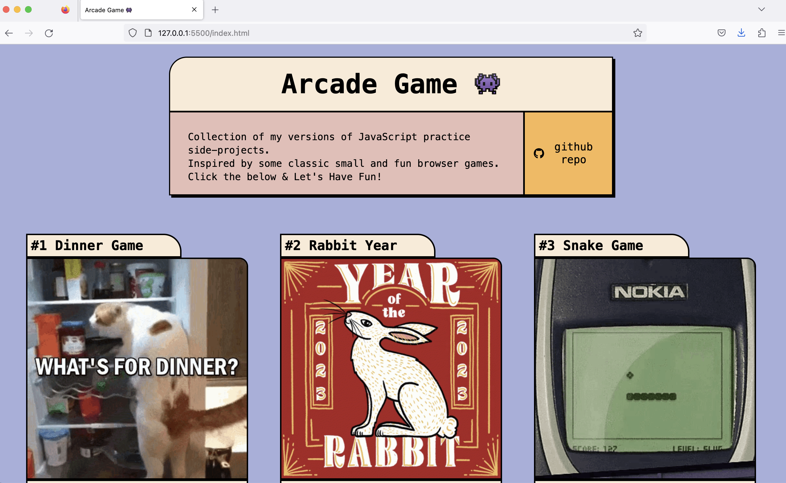
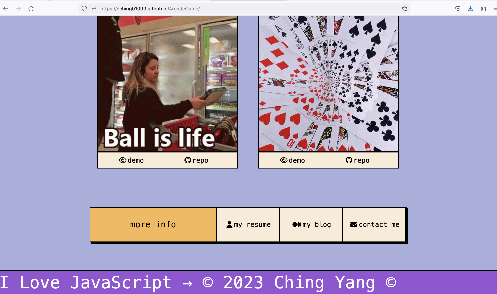

# Arcade Game 蹦蹦遊戲廳 👾

靜態畫面

## 📌 專案目的

集結過往使用 Vanilla JavaScript 所撰寫的有趣小遊戲，歡迎來此玩樂！

## 🎯 專案功能

- 點擊各項遊戲的 demo 即可立即遊玩
- 點擊各項遊戲的 repo 可連結至專案的儲存庫，查看程式碼
- 點擊 more info 右側的各項欄位，可導連至本作者其他資訊

## ✔️ 專案使用

1. 將專案 clone 到本地
2. 在本地開啟之後，透過終端機進入資料夾
3. 打開瀏覽器，並輸入 http://127.0.0.1:5500/ 進入首頁

## 🎮 立即體驗

點按即進入遊戲：https://cching01099.github.io/ArcadeGame/
